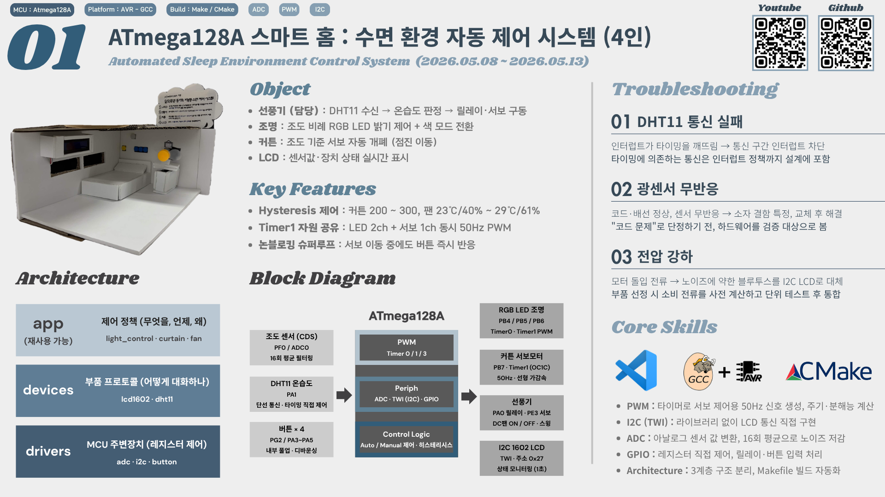
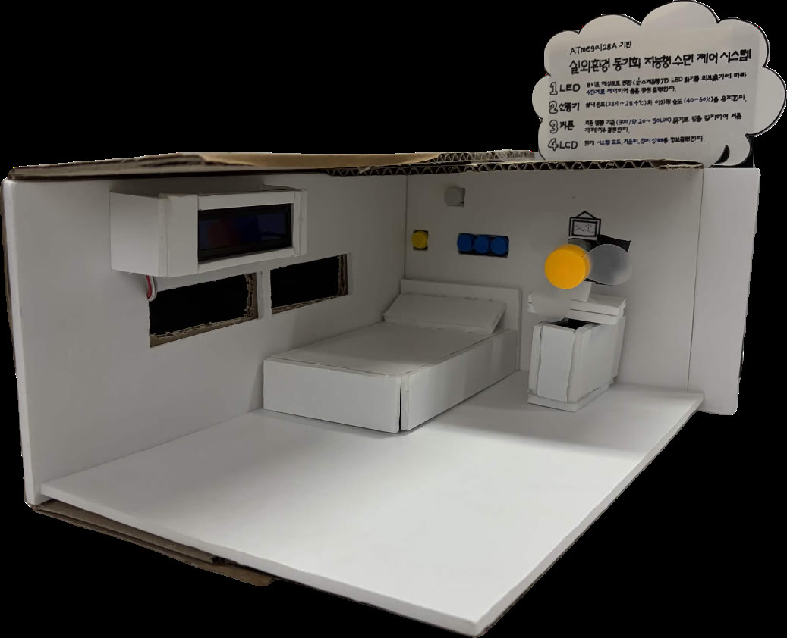
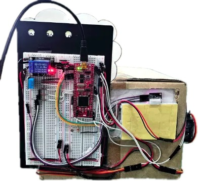
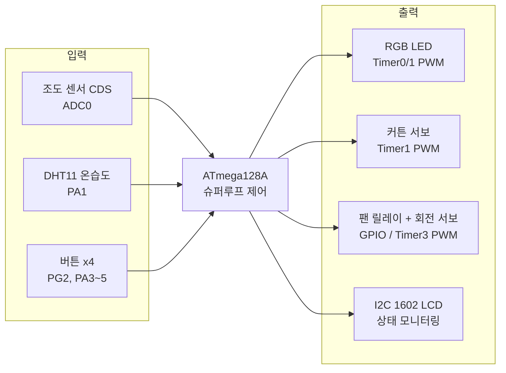
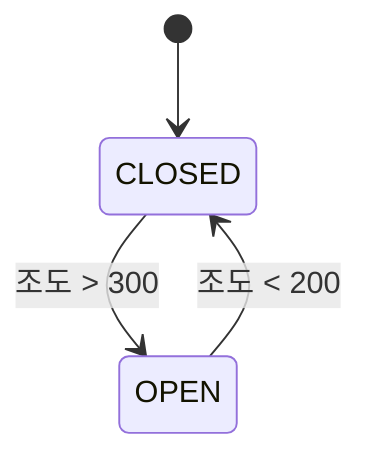
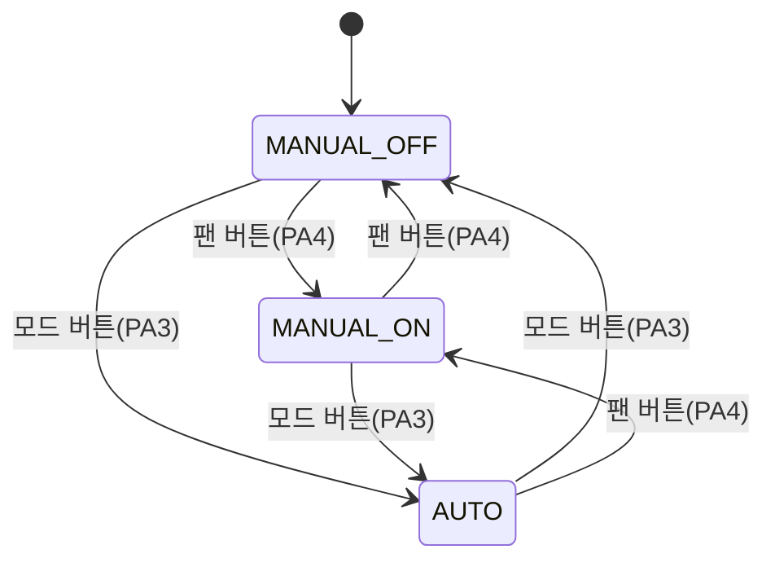
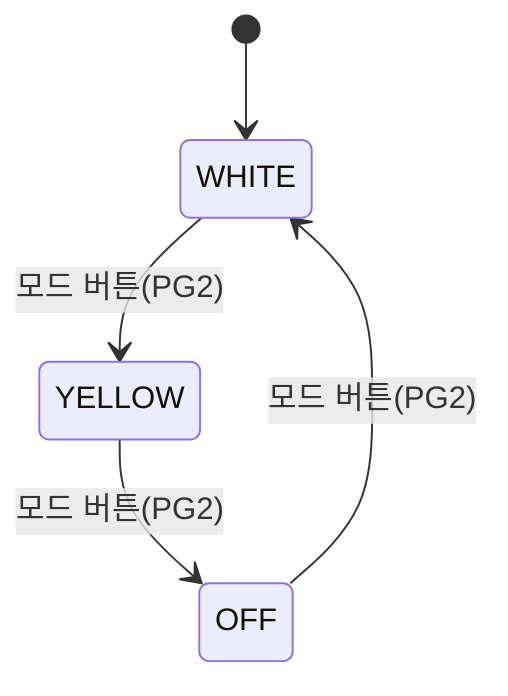

<div align="center">

# 🏠 ATmega128A 스마트 홈 : 수면 환경 자동 제어 시스템

### Automated Sleep Environment Control System (Team of 4)

<br>


<br>


</div>
<br>

<p align="center">
  
</p>

<br>

<p align="center">    &nbsp;  </p><p align="center"><i>디오라마 전면 (좌) · 후면 회로 구성 (우)</i></p>

<br>

수면 환경을 자동으로 관리하는 **ATmega128A 기반 스마트 홈 제어 시스템**입니다. 베어메탈 환경에서 **ADC 기반 조도 측정, Timer/PWM 기반 LED·서보모터 제어, TWI 기반 I2C LCD 통신, GPIO 비트뱅잉 기반 DHT11 온·습도 통신**을 구현했습니다. 조도와 온·습도 측정값에 따라 **조명, 커튼, 선풍기를 자동 제어**하며, 버튼을 이용한 수동 제어 기능도 지원합니다.

<br>

## 0. 목차

1. [시연](#1-시연)
2. [핵심 기술 요약](#2-핵심-기술-요약)
3. [프로젝트 개요](#3-프로젝트-개요)
4. [주요 기능](#4-주요-기능)
5. [시스템 구성](#5-시스템-구성)
6. [아키텍처](#6-아키텍처)
7. [핀맵](#7-핀맵)
8. [상태 전이](#8-상태-전이)
9. [실행 구조](#9-실행-구조)
10. [설계 포인트](#10-설계-포인트)
11. [Troubleshooting](#11-troubleshooting)
12. [한계 및 차기 프로젝트 반영](#12-한계-및-차기-프로젝트-반영)
13. [빌드](#13-빌드)

<br>

## 1. 시연

조도 센서를 손으로 가리면 커튼이 서보모터로 부드럽게 닫히고, LCD에 각 장치 상태가 실시간 표시됩니다.

<p align="center">
  
</p>

<!-- 아래 줄에 GitHub 업로드 영상 URL(user-attachments)을 단독 한 줄로 붙여넣으면 인라인 재생됩니다 -->

▶ **전체 시연 영상 (1분 42초)** : [YouTube에서 보기](https://www.youtube.com/watch?v=3G_67dsU_wg) — LED 색 모드 전환, 선풍기 자동/수동 모드, 회전 스윙, 커튼 개폐, LCD 모니터링

<br>

## 2. 핵심 기술 요약

| 분류 | 핵심 기술 |
|---|---|
| **MCU** | ATmega128A 베어메탈 (레지스터 직접 제어, HAL 미사용) |
| **PWM** | Timer 0/1/3 Fast PWM — 서보 2개 + RGB LED 동시 구동 |
| **ADC** | 조도 센서 폴링, 16회 평균 필터링 |
| **I2C** | TWI 마스터 직접 구현 (1602 LCD 제어) |
| **비트뱅잉** | DHT11 단선 프로토콜 타이밍 직접 구현 |
| **제어 기법** | 히스테리시스 · 서보 선형 가감속 · 디바운싱 |
| **구조** | 논블로킹 슈퍼루프, 3계층 아키텍처, CMake / Makefile 빌드 |

<br>

## 3. 프로젝트 개요

**기간** : 2026.05.08 ~ 05.13 (6일) | **팀** : 4인

### 3-1. 프로젝트 일정

| 일정 | 단계 |
|---|---|
| 05.08 ~ 09 | 주제 선정, S/W 설계 (환경 센서·액추에이터 선정, 모듈별 독립 코드 설계) |
| 05.10 ~ 11 | H/W 설계 (시스템 물리 인프라), 시스템 통합 및 H/W-S/W 통합 디버깅 |
| 05.12 ~ 13 | 시나리오별 자동 제어 동작 시연, 최종 발표 |
| 08.04 | 사후 보완 — 계층형 아키텍처 리팩토링, CMake/Make 빌드 정비, 문서화 및 Git 저장소 구성 |

### 3-2. 역할 분담

| 팀원 | 담당 |
|---|---|
| **이현지 (본인)** | 선풍기 및 버튼 코드 구현, 환경 데이터 분석 및 알고리즘 설계 |
| 팀원 A | LED 코드 구현, 회로 구성 및 하드웨어 시스템 설계 |
| 팀원 B | 커튼 코드 구현, 회로 구성 및 하드웨어 시스템 설계 |
| 팀원 C | LCD 코드 구현 및 각 로직 통합, UART(블루투스) 통신 시도 (전압 강하 이슈로 I2C LCD로 대체) |

**사후 보완 (이현지)** : 프로젝트 종료 후 코드 품질 개선 작업

- 계층형 아키텍처(drivers / devices / app)로 전체 리팩토링 — 하드웨어 의존 코드와 제어 정책 분리
- 모듈별 .c/.h 재구성 (I2C·ADC 드라이버 독립, DHT11 프로토콜을 팬 제어 정책에서 분리)
- 함수 네이밍 컨벤션 통일, 오타·데드 코드 제거, Makefile 빌드 자동화
- Git 저장소 구성 및 머지 관리

<br>

## 4. 주요 기능

- **조명** : 조도 센서 값에 비례한 RGB LED 밝기 제어, 버튼으로 색 모드 전환 (흰색 / 노란색 / 꺼짐)
- **커튼** : 조도에 따른 서보 자동 개폐. 히스테리시스(열림 >300, 닫힘 <200)로 채터링 방지, 각도 점진 이동으로 관성 충격 제거
- **선풍기** : DHT11 온습도 기반 자동 제어 (ON: ≥29℃ 또는 ≥61% / OFF: ≤23℃ 그리고 ≤40% / 그 외 상태 유지), 수동 모드 전환 및 회전(스윙) 서보 지원
- **LCD** : I2C 1602 LCD에 온도·습도·조도와 각 장치 상태를 1초 주기로 표시

  ```
  t:25 h:40 l:0512      ← 온도(℃) / 습도(%) / 조도(ADC 0~1023)
  fan:o led:o ct:x      ← 선풍기 / 조명 / 커튼 (o=동작, x=정지)
  ```

<br>

## 5. 시스템 구성



<br>

## 6. 아키텍처

하드웨어 의존 코드와 제어 정책을 분리한 3계층 구조입니다.
MCU를 교체하더라도 `app/` 계층은 수정 없이 재사용할 수 있도록 설계했습니다.

```
┌──────────────────────────────────────────────────┐
│                                                  │
│   app/       제어 정책 (무엇을, 언제, 왜)        │
│              light_control · curtain · fan       │
│                                                  │
├──────────────────────────────────────────────────┤
│                                                  │
│   devices/   부품 프로토콜 (어떻게 대화하는가)     │
│              lcd1602 · dht11                     │
│                                                  │
├──────────────────────────────────────────────────┤
│                                                  │
│   drivers/   MCU 주변장치 (레지스터 제어)        │
│              adc · i2c · button                  │
│                                                  │
└──────────────────────────────────────────────────┘
```

```
Project01_SmartHome/
├── main.c                    # 메인 루프 (측정 → 입력 → 제어 → 주기 작업)
├── config.h                  # 공통 설정 (F_CPU)
├── CMakeLists.txt            # CMake 빌드 설정
├── avr-gcc-toolchain.cmake   # AVR 크로스 컴파일 툴체인
├── Makefile                  # Make 빌드 설정
├── drivers/
│   ├── adc.c/h         # 내장 ADC (AVCC 기준, 분주비 128)
│   ├── i2c.c/h         # TWI 마스터 (100kHz)
│   └── button.c/h      # 버튼 엣지 검출 + 디바운싱
├── devices/
│   ├── lcd1602.c/h     # I2C 백팩 1602 LCD (4비트 모드)
│   └── dht11.c/h       # DHT11 단선 통신 (타임아웃 안전장치 포함)
├── app/
│   ├── light_control.c/h
│   ├── curtain.c/h
│   └── fan_control.c/h
└── test/
    └── lcd_hw_test.c   # LCD 단독 하드웨어 점검용 (빌드 대상 아님)
```

<br>

## 7. 핀맵

| 기능 | 핀 | 비고 |
|---|---|---|
| RGB LED (R/G/B) | PB4 / PB5 / PB6 | Timer0(OCR0) / Timer1(OCR1A/OCR1B) PWM |
| 커튼 서보 | PB7 | Timer1 OCR1C, 50Hz |
| 팬 릴레이 | PA0 | Active-Low (LOW = ON) |
| 팬 회전 서보 | PE3 | Timer3 OCR3A, 50Hz |
| DHT11 | PA1 | 내부 풀업 |
| 조도 센서 (CDS) | ADC0 (PF0) | 16회 평균 |
| 조명 모드 버튼 | PG2 | 내부 풀업 |
| 팬 자동/수동 · ON/OFF · 회전 버튼 | PA3 / PA4 / PA5 | 내부 풀업 |
| I2C LCD | TWI (0x27) | PCF8574 백팩 |

<br>

## 8. 상태 전이

각 제어 모듈은 상태 변수를 두고 센서 값 또는 버튼 입력에 따라 전이합니다.
켜짐/꺼짐 임계값을 분리한 히스테리시스로 경계값 부근의 반복 동작(채터링)을 방지했습니다.

### 8-1. 커튼 (조도 기반)



조도 200~300 구간은 현재 상태를 유지하며(히스테리시스), 개폐 시 목표 각도까지 1스텝씩 점진 이동합니다.

### 8-2. 선풍기 (모드 × 동작 상태)



AUTO 상태에서는 2초 주기로 DHT11을 측정하여 릴레이와 회전 서보를 함께 제어합니다.

| 측정 결과 | 판정 | 동작 |
|---|---|---|
| 온도 ≥ 29℃ **또는** 습도 ≥ 61% | ON 조건 | 팬 ON + 회전 ON |
| 온도 ≤ 23℃ **그리고** 습도 ≤ 40% | OFF 조건 | 팬 OFF + 회전 OFF |
| 그 외 구간 | 유지 | 이전 상태 유지 |
| 체크섬 실패 / 타임아웃 | 측정 실패 | 안전을 위해 팬 OFF |

### 8-3. 조명 (버튼 순환)



색 모드와 무관하게 밝기는 조도 센서 값에 비례합니다 (최소 밝기 하한 적용).

<br>

## 9. 실행 구조

RTOS 없이 슈퍼루프 기반 협조적 스케줄링(cooperative scheduling)으로 동작합니다.
블로킹 딜레이 없이 틱 카운터로 주기를 분할하여, 서보가 움직이는 중에도 버튼 입력이 즉시 반응합니다.

```
loop (≈1ms)
 ├─ 조도 측정 (ADC 16회 평균)
 ├─ 버튼 4개 이벤트 처리
 ├─ 조명 갱신 / 커튼 갱신
 ├─ 2000틱마다 → DHT11 측정 + 자동 팬 제어
 ├─ 회전 서보 1스텝 진행 (논블로킹)
 └─ 1000틱마다 → LCD 갱신
```

<br>

## 10. 설계 포인트

- **논블로킹 메인 루프** : 서보 스윙·커튼 이동·주기 작업을 딜레이 없이 틱 카운터로 처리하여, 버튼 응답성과 다중 장치 동시 제어를 확보
- **Timer1 자원 공유** : 하나의 Timer1(50Hz)로 LED G/B 채널(OCR1A/B)과 커튼 서보(OCR1C)를 동시에 구동 — 초기화 순서 의존성을 주석으로 명시
- **DHT11 통신 안정화** : 비트 단위 타임아웃 안전장치와 통신 구간 인터럽트 차단(`cli`/`sei`)으로 마이크로초 타이밍 보장, 체크섬 검증
- **히스테리시스** : 커튼(조도)과 팬(온습도) 모두 ON/OFF 임계값을 분리하여 경계값 부근에서의 반복 동작 방지
- **정책/장치 분리** : DHT11 모듈은 측정만 담당하고, "몇 도에 팬을 켤 것인가"는 app 계층이 결정 — 임계값 변경 시 센서 코드를 건드릴 필요 없음

<br>

## 11. Troubleshooting

### 11-1. 돌입 전류로 인한 전압 강하 → 통신 방식 변경

- **문제** : DC 모터(EZ Motor R300)와 서보 모터(MG996R) 2대의 돌입 전류로 전압 강하가 발생하여 UART 통신이 원활하지 않음
- **해결** : 노이즈에 민감한 HC-05 블루투스 모듈을 설계에서 배제하고, 노이즈에 강한 I2C 방식 LCD로 모니터링 인터페이스를 대체
- **배운 점** : 데이터시트로 구동 전압·최대 소비 전류·대기 전력을 사전 계산하고, 단위별 부하 테스트를 거친 후 보드에 통합해야 함

### 11-2. 광센서(CDS) 하드웨어 초기 불량

- **문제** : 펌웨어와 배선이 정상임에도 조도 변화 감지가 불가능
- **해결** : 변수 통제와 팀원 간 교차 검증으로 원인을 소자 내부 단선(하드웨어 결함)으로 특정, 소자 교체 후 정상적인 조도 데이터 수집 및 시스템 연동에 성공
- **배운 점** : "코드 문제"로 단정하기 전에 하드웨어도 검증 대상에 포함해야 함. 사전 계측기 검증과 피드백 채널의 중요성

### 11-3. 커튼 서보모터 관성 문제

- **문제** : 90°→0° 이동 시 목표 PWM 펄스 폭을 한 번에 최대치로 변경하면 관성 때문에 목표 지점에 깔끔하게 정지하지 못함
- **해결** : 선형 가감속 구현 — 즉각적인 각도 조절 대신 5ms에 한 번씩 각도를 업데이트하여 약 1.1초에 걸쳐 부드럽게 개폐 (`app/curtain.c`의 점진 이동 로직)

### 11-4. 선풍기 속도 제어에 PWM 미사용

- **문제** : 무드등(RGB LED)과 커튼 서보 제어에 타이머 PWM 기능을 우선 할당하여 가용 PWM 핀이 부족
- **해결** : 릴레이 사용 시 일반 출력으로 충분하다고 판단, MCU의 전류 문제(40mA 출력 제한)와 모터의 전압 문제를 일반 GPIO + 릴레이 조합으로 해결

<br>

## 12. 한계 및 차기 프로젝트 반영

이 프로젝트에서 확인한 한계를 다음 프로젝트(ARM 기반)에서 개선 로직으로 반영했습니다.

| 이번 프로젝트에서 확인한 한계 | 차기 프로젝트 반영 |
|---|---|
| 폴링 기반 즉시 반응으로 인한 버튼 오작동 여지 | 명시적 FSM 도입으로 상태 기반 입력 처리 |
| I2C 통신으로 인한 느린 모니터링 속도 | 전원 설계를 보강한 보드에서 UART 통신으로 전환 |

<br>

## 13. 빌드

CMake와 Make 두 가지 빌드 방식을 지원합니다. 소스는 와일드카드로 자동 수집됩니다.

**CMake** (개발 환경 : VSCode + AVR-GCC)

```bash
cmake -B build -DCMAKE_TOOLCHAIN_FILE=avr-gcc-toolchain.cmake
cmake --build build
```

**Make** (CMake 없이 바로 빌드)

```bash
make          # 전체 컴파일 → smart_home.hex 생성
make size     # 플래시/RAM 사용량 확인
make flash    # 보드 플래시 (avrdude, 프로그래머 환경에 맞게 수정)
make clean    # 빌드 산출물 삭제
```

빌드 결과 : 플래시 2.85% (3,734 B / 128 KB), RAM 2.2% (90 B / 4 KB)
