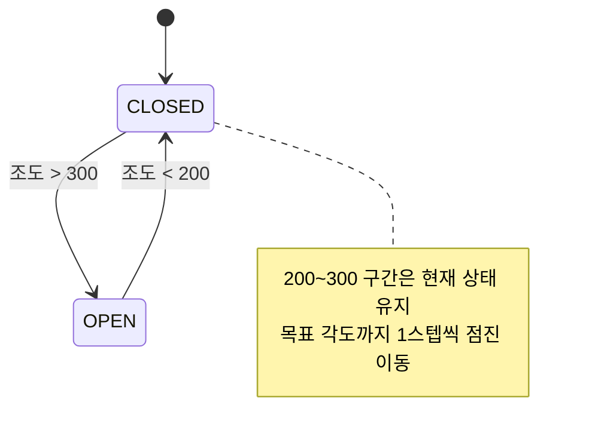
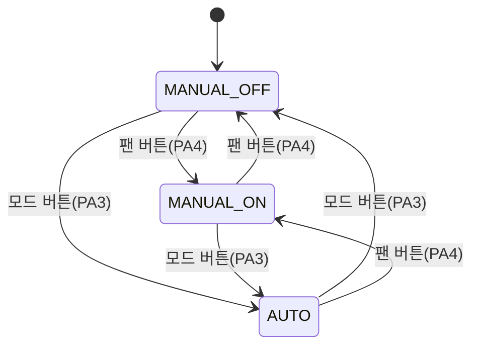
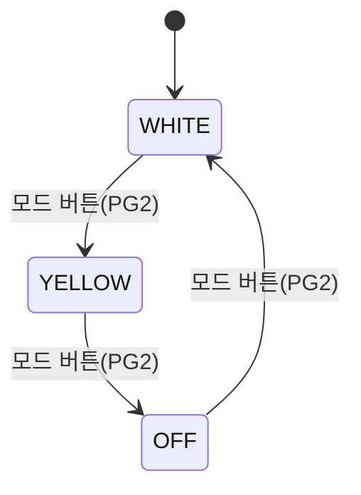

# ATmega128A Smart Home Controller

조도·온습도 센서 기반으로 조명, 커튼, 선풍기를 제어하는 스마트 홈 프로젝트입니다.
베어메탈(레지스터 직접 제어) 환경에서 논블로킹 메인 루프와 계층형 아키텍처로 구현했습니다.

## 주요 기능

- **조명**: 조도 센서 값에 비례한 RGB LED 밝기 제어, 버튼으로 색 모드 전환 (흰색 / 노란색 / 꺼짐)
- **커튼**: 조도에 따른 서보 자동 개폐. 히스테리시스(열림 >300, 닫힘 <200)로 채터링 방지, 각도 점진 이동으로 관성 충격 제거
- **선풍기**: DHT11 온습도 기반 자동 제어 (ON: ≥29℃ 또는 ≥61% / OFF: ≤23℃ 그리고 ≤40% / 그 외 상태 유지), 수동 모드 전환 및 회전(스윙) 서보 지원
- **LCD**: I2C 1602 LCD에 온도·습도·조도와 각 장치 상태를 1초 주기로 표시

## 아키텍처

하드웨어 의존 코드와 제어 정책을 분리한 3계층 구조입니다.
MCU를 교체하더라도 `app/` 계층은 수정 없이 재사용할 수 있도록 설계했습니다.

```
┌─────────────────────────────────────────────┐
│  app/        제어 정책 (무엇을, 언제, 왜)      │
│              light_control · curtain · fan   │
├─────────────────────────────────────────────┤
│  devices/    부품 프로토콜 (어떻게 대화하는가)  │
│              lcd1602 · dht11                 │
├─────────────────────────────────────────────┤
│  drivers/    MCU 주변장치 (레지스터 제어)      │
│              adc · i2c · button              │
└─────────────────────────────────────────────┘
```

```
smart_home/
├── main.c              # 메인 루프 (측정 → 입력 → 제어 → 주기 작업)
├── config.h            # 공통 설정 (F_CPU)
├── drivers/
│   ├── adc.c/h         # 내장 ADC (AVCC 기준, 분주비 128)
│   ├── i2c.c/h         # TWI 마스터 (100kHz)
│   └── button.c/h      # 버튼 엣지 검출 + 디바운싱
├── devices/
│   ├── lcd1602.c/h     # I2C 백팩 1602 LCD (4비트 모드)
│   └── dht11.c/h       # DHT11 1-Wire 프로토콜 (타임아웃 안전장치 포함)
├── app/
│   ├── light_control.c/h
│   ├── curtain.c/h
│   └── fan_control.c/h
└── test/
    └── lcd_hw_test.c   # LCD 단독 하드웨어 점검용 (빌드 대상 아님)
```

## 핀맵

| 기능 | 핀 | 비고 |
|---|---|---|
| RGB LED (R/G/B) | PB4 / PB5 / PB6 | Timer0(OCR0) / Timer1(OCR1A/OCR1B) PWM |
| 커튼 서보 | PB7 | Timer1 OCR1C, 50Hz |
| 팬 릴레이 | PA0 | Active-Low (LOW = ON) |
| 팬 회전 서보 | PE3 | Timer3 OCR3A, 50Hz |
| DHT11 | PA1 | 내부 풀업 |
| 조도 센서 (CDS) | ADC0 (PF0) | 16회 평균 |
| 조명 모드 버튼 | PG2 | 내부 풀업 |
| 팬 자동/수동 · ON/OFF · 회전 버튼 | PA3 / PA4 / PA5 | 내부 풀업 |
| I2C LCD | TWI (0x27) | PCF8574 백팩 |

## 상태 전이

각 제어 모듈은 상태 변수를 두고 센서 값 또는 버튼 입력에 따라 전이합니다.
켜짐/꺼짐 임계값을 분리한 히스테리시스로 경계값 부근의 반복 동작(채터링)을 방지했습니다.

### 커튼 (조도 기반)



### 선풍기 (모드 × 동작 상태)



AUTO 상태에서는 2초 주기로 DHT11을 측정하여 릴레이와 회전 서보를 함께 제어합니다.

| 측정 결과 | 판정 | 동작 |
|---|---|---|
| 온도 ≥ 29℃ **또는** 습도 ≥ 61% | ON 조건 | 팬 ON + 회전 ON |
| 온도 ≤ 23℃ **그리고** 습도 ≤ 40% | OFF 조건 | 팬 OFF + 회전 OFF |
| 그 외 구간 | 유지 | 이전 상태 유지 |
| 체크섬 실패 / 타임아웃 | 측정 실패 | 안전을 위해 팬 OFF |

### 조명 (버튼 순환)



색 모드와 무관하게 밝기는 조도 센서 값에 비례합니다 (최소 밝기 하한 적용).

## 실행 구조

RTOS 없이 슈퍼루프 기반 협조적 스케줄링(cooperative scheduling)으로 동작합니다.
블로킹 딜레이 없이 틱 카운터로 주기를 분할하여, 서보가 움직이는 중에도 버튼 입력이 즉시 반응합니다.

```
loop (≈1ms)
 ├─ 조도 측정 (ADC 16회 평균)
 ├─ 버튼 4개 이벤트 처리
 ├─ 조명 갱신 / 커튼 갱신
 ├─ 2000틱마다 → DHT11 측정 + 자동 팬 제어
 ├─ 회전 서보 1스텝 진행 (논블로킹)
 └─ 1000틱마다 → LCD 갱신
```

## 설계 포인트

- **논블로킹 메인 루프**: 서보 스윙·커튼 이동·주기 작업을 딜레이 없이 틱 카운터로 처리하여, 버튼 응답성과 다중 장치 동시 제어를 확보
- **Timer1 자원 공유**: 하나의 Timer1(50Hz)로 LED G/B 채널(OCR1A/B)과 커튼 서보(OCR1C)를 동시에 구동 — 초기화 순서 의존성을 주석으로 명시
- **DHT11 통신 안정화**: 비트 단위 타임아웃 안전장치와 통신 구간 인터럽트 차단(`cli`/`sei`)으로 마이크로초 타이밍 보장, 체크섬 검증
- **히스테리시스**: 커튼(조도)과 팬(온습도) 모두 ON/OFF 임계값을 분리하여 경계값 부근에서의 반복 동작 방지
- **정책/장치 분리**: DHT11 모듈은 측정만 담당하고, "몇 도에 팬을 켤 것인가"는 app 계층이 결정 — 임계값 변경 시 센서 코드를 건드릴 필요 없음

## 빌드

Microchip Studio에서 ATmega128A 타겟으로 전체 소스를 포함해 빌드하거나, avr-gcc로:

```bash
avr-gcc -mmcu=atmega128 -Os -DF_CPU=16000000UL \
  main.c drivers/*.c devices/*.c app/*.c -o smart_home.elf
avr-objcopy -O ihex smart_home.elf smart_home.hex
```
